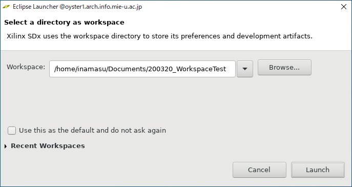
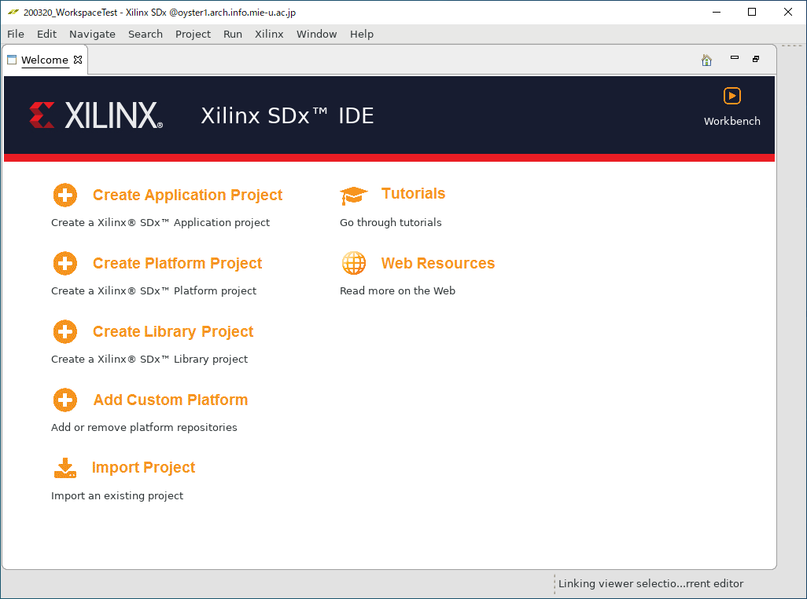
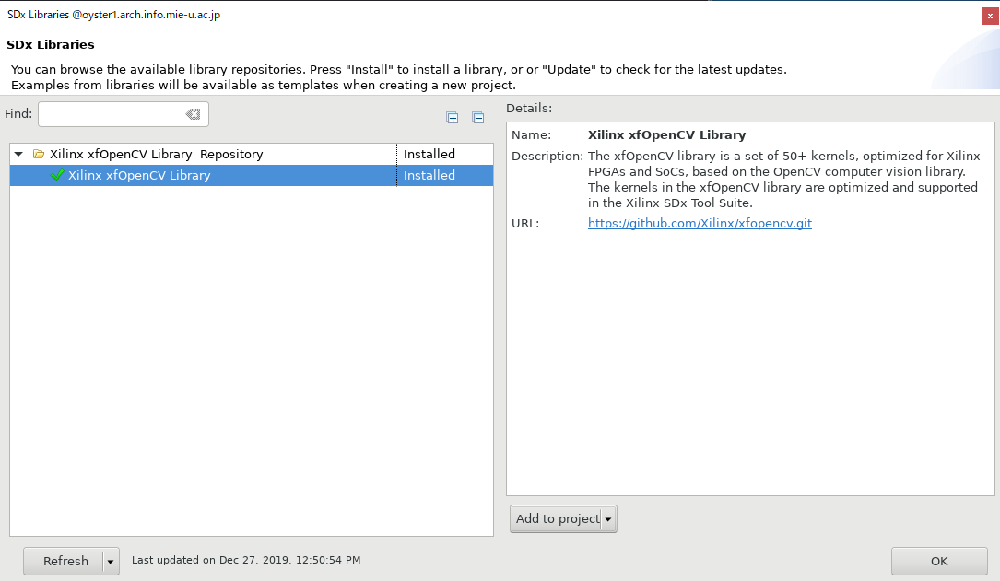
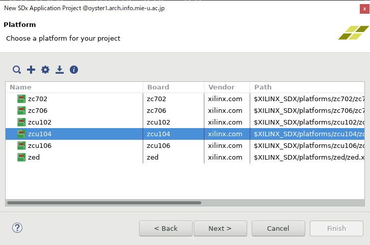
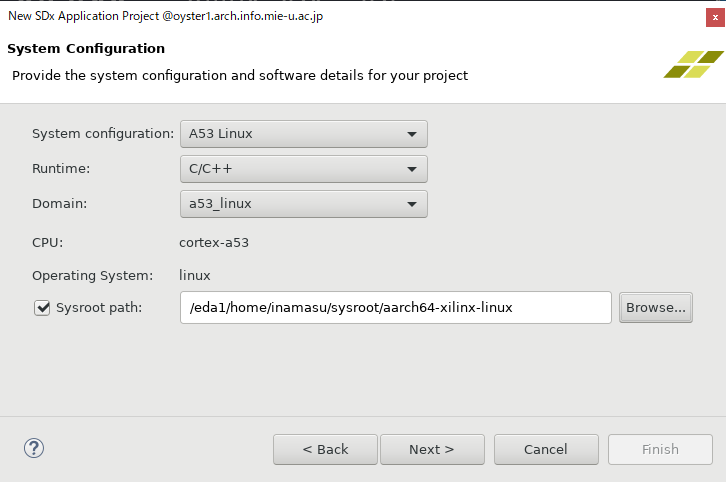
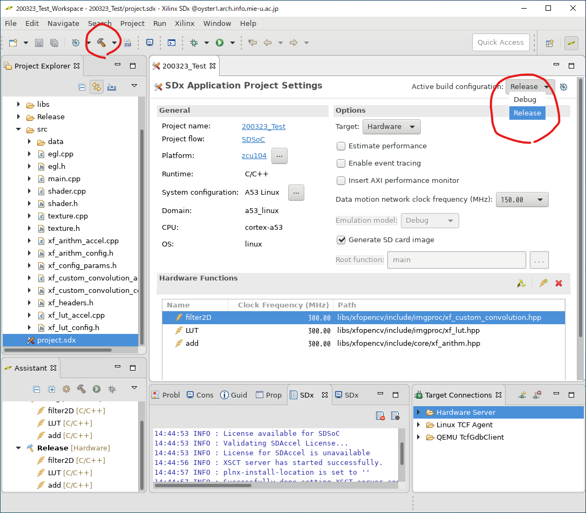

# xfOpenCV-PostProcess
Implement PostProcess with xfOpenCV

作成者 : 稲益秀成

## 概要

Xilinx UltraScale+ MPSoC ZCU104 評価キットで動作するプログラムです。

ポストプロセッシングエフェクト(ポストエフェクト)の"Bloom"をFPGAまたはGPUで実行できます。

FPGA回路はxfOpenCVライブラリ、GPUプログラムはEGLライブラリおよびOpenGL ES 2.0 APIを用いて実装しました。
開発環境はXilinx SDx v2019.1です。


## ビルド済みファイルの実行方法

### 1. ビルド済みファイルをコピー

`share/inamasu/2020/EvaluationProgram/Build/200129_SDCard_filterSize(5|15)_N0_300MHz`のどちらか一方のフォルダ内のファイルを自分の作業環境にコピーする。
<!-- [200117_bloom_sd.zip](https://github.com/Rinadehi/xfOpenCV-PostProcess/releases/download/v2020.1.17/200117_bloom_sd.zip) をダウンロードし、展開する。 -->

### 2. SDカードにファイルを配置

microSDカードをFAT32にフォーマットする。

`200129_SDCard_filterSize(5|15)_N0_300MHz`内のファイルをmicroSDカードにコピーする。

### 3. ZCU104に各種デバイスを接続

1. ZCU104ボードのDIPスイッチ(SW6)を以下のように設定する。
```
DIP switch SW6:
Mode0 (#1) OFF
Mode1 (#2) ON
Mode2 (#3) OFF
Mode3 (#4) ON
```

2. SDカードをZCU104に挿入する。

3. ZCU104をDisplayPortケーブルでモニターと接続する。

4. USB TypeA端子にUSBキーボード、またはUSBハブ経由でUSBキーボードとUSBマウスを接続する。

5. microUSBケーブルでPCと接続する。

### 4. ブート後の作業


ZCU104でターミナルを開くには、
(1)microUSBでPCと接続し、シリアル通信でターミナルを開く方法 と、
(2)直接ディスプレイとUSBキーボードを接続する方法
の二種類がある。

まずは(1)の方法で作業を行う。
microUSBでPCと接続し、ターミナルを開く。ボーレートは115200に設定する。
(ターミナルには、WindowsPCならTeraTermなどを用いるとよい)


ZCU104の電源スイッチをオンにするとLinuxが起動する。
数分後、入力受付状態になるので、(1)のターミナルで以下のコマンドを実行する。
```
root@xilinx-zcu104-2019_1:~# echo "exec matchbox-terminal" > /home/root/.Xsession
root@xilinx-zcu104-2019_1:~# chmod +x /home/root/.Xsession
root@xilinx-zcu104-2019_1:~# killall Xorg
```
ここで、(2)の直接接続したディスプレイとキーボードの方でターミナルが全画面に表示されるので、以下のコマンドを(2)のターミナルで実行する。
```
# xinit /etc/X11/Xsession
```
すると、(2)のターミナルのフォントや表示が少し変化するので、
(1)のターミナルに戻って、以下のコマンドを実行する。
```
root@xilinx-zcu104-2019_1:~# export DISPLAY=:0.0
root@xilinx-zcu104-2019_1:~# cd /mnt/
root@xilinx-zcu104-2019_1:/mnt# export LD_LIBRARY_PATH=/mnt/lib/
```
これでプログラムが実行できるようになる。


### 5. プログラムの実行方法

プログラムの実行方法は、`root@xilinx-zcu104-2019_1:/mnt# ./EGL_xfOpenCV.elf`となっている。

```
Usage:	./EGL_xfOpenCV.elf [-f -n number] [-g] [-v] [-m number(1~4)] [-p png-file-name] [-i number(0~10)]

Options:
	 -f : Enable FPGA acceleration / -g : Enable GPU acceleration 
	 -n : Exection time at FPGA mode 	(default : 100)
	 -v : Enable verbose 	(default : false)
	 -m : Change mode at GPU	(default : 1234)
	 -p : Set png file 	(default : Torus.png)
	 -i : Set eglSwapInterval() 0:No Limit, 1:60fps 2:30fps 3:20fps ... 	(default : 0)
```


(必ずカレントディレクトリを/mnt/に変更すること。もし./mnt/EGL_xfOpenCV.elfのように実行した場合、GPU用のシェーダーコードを読み込めずにエラーになる)

`-p Torus.png`のように`-p`オプションで読み込む画像ファイルを変更できる。

#### FPGAで実行する場合
```
# ./EGL_xfOpenCV.elf -f
```
とコマンドを実行する。Bloomの各フェーズおよび全体の実行時間が測定される。

もし途中でLinux カーネルがフリーズしたりするようなら、`-n 10`といったように`n`オプションで実行回数を変更するとよい。


#### GPUで実行する場合
```
# ./EGL_xfOpenCV.elf -g
```
とコマンドを実行する。FPGA実行とは異なり、全体の実行時間が測定される。

Bloomの各フェーズごとの実行時間を測定する場合は、`-m`オプションを使用する。
* `-m 1` : 画像の読み込み後、そのまま描画
* `-m 12` : 画像読み込み、高輝度取り出し処理後描画
* `-m 123` :  画像読み込み、高輝度取り出し、ぼかしフィルタ処理後描画
* `-m 1234` : Bloom処理全体の実行 (デフォルト)

OpenGL側のバージョンや、OpenGL実行中に発生したエラーを表示する際は`-v`オプションを指定する。

フレームレートに制限を書ける場合は`-i`オプションを使用する。
* `-i 0` : フレームレート制限無し(デフォルト)
* `-i 1` : 60fps制限
* `-i 2` : 30fps制限
* `-i 3` : 20fps制限

## 実験パラメータの変更方法

### 入力画像サイズの変更
microSDカード内に画像を配置し、以下のようにプログラムを実行する。
```
# ./EGL_xfOpenCV.elf -p 画像ファイル名.png
```

### フィルタサイズの変更
フィルタサイズ5の場合は`200129_SDCard_filterSize5_N0_300MHz`のファイルを使用し、
15の場合は`200129_SDCard_filterSize15_N0_300MHz`のファイルを使用する。

他のフィルタサイズを設定する場合は再ビルドが必要。

`xf_config_params.h`にて、
```xf_config_params.h
#define  FILTER_HEIGHT  15
#define  FILTER_WIDTH  	15
```
`main.cpp`にて、
```main.cpp
#define SAMPLE_COUNT 15
```
と変更し、再ビルド。


## 開発環境

### ビルド環境
Oyster1
* CentOS 7.7.1908 Core
* Xilinx SDx v2019.1 (64-bit)
* xfOpenCV 2019.1

### 実行環境

* Xilinx Zynq UltraScale+ MPSoC ZCU104 評価キット 

## 各ファイルの説明

`workspace/EGL_xfOpenCV/src`内のファイルの内容は、以下の通りである。

|ファイル名|内容|
|:-------:|----|
|data| ビルドした際に`Release/sd_card/`にコピーされるファイル。テスト用の画像やopenCVのライブラリファイル、GPU用のシェーダーコードを配置してある。|
|egl.cpp / .h| GPUプログラムにおけるEGLライブラリ関連のコード
|main.cpp | メイン関数|
|shader.cpp / .h|GPUプログラムにおけるシェーダーコードを実行するためのコード|
|texture.cpp / h|画像ファイルを読み込むためのコード|
|xf_arithm_*|xfOpenCVにおけるadd関数を使うためのファイル (xfOpenCVのサンプルまま) |
|xf_config_params.h | xfOpenCVの各設定を行うためのパラメータ|
|xf_custom_convolution_*|xfOpenCVにおけるfilter2D関数を使うためのファイル (xfOpenCVのサンプルまま) |
|xf_headers.h|openCVなどのインクルードがされるファイル(ほぼxfOpenCVのサンプルまま) |
|xf_lut_*|xfOpenCVにおけるLUT関数を使うためのファイル (xfOpenCVのサンプルまま) |

## ビルド方法

### 0. Workspaceの作成
自分のホームディレクトリ内などに適当な作業ディレクトリを作成する。以下、workspaceと呼ぶ。

### 1. zcu104-rv-ss-2018-3.zipの展開
`share/inamasu/2020/EvaluationProgram/Source/zcu104-rv-ss-2018-3.zip`を自分のホームディレクトリ内などの適当な場所にコピーし、展開する。

このzipファイルは、[reVISION 入門ガイド 3. ソフトウェア ツールおよびシステム要件](https://github.com/Xilinx/reVISION-Getting-Started-Guide/blob/master/docs-jp/Docs/software-tools-system-requirements.md) 内の[zcu104-rv-ss-2018-3.zip](https://japan.xilinx.com/member/forms/download/design-license-xef.html?filename=zcu104-rv-ss-2018-3.zip)
からもダウンロードできる。

### 2. Vivado SDxの起動
SDxライセンスが通っているPCで`$ sdx`コマンドを実行し、Vivado SDxを起動する。
(ライセンスの有無については先生に相談するとよい)

0.で作成したWorkspaceを指定し、Launchをクリックする。



### 3. xfOpenCVライブラリのインストール
Welcomeスクリーンが表示されたら、メニューバーから Xilinx -> SDx Libraries... を選択する。



xfOpenCVライブラリをインストールする。



### 4. 新しいプロジェクトの作成

メニューから File -> New -> SDx Application Project を選択し、適当なプロジェクト名をつける。


Platformは**ZCU104**を指定する。




System Configurationでは、
 * System configuration : **A53 Linux**
 * Runtime : **C/C++**
 * Domain : **a53_linux**
 * Sysroot path : `/<ダウンロードしたzcu104-rv-ss-2018-3を展開したディレクトリ>/zcu104_rv_ss/sw/a53_linux/a53_linux/sysroot/aarch64-xilinx-linux`

と設定する。




Templatesでは、**customconv - File I/O**を選択し、Finishをクリック


以上の手順でサンプルプロジェクトを作成できる。

### 5. ソースのコピー

一度Xilinx SDxを終了する。

Gitリポジトリをクローンするか、`share/inamasu/2020/EvaluationProgram/Source/200322_source.zip`をコピーし、展開する。

作成したプロジェクトの`<Workspace>/<ProjectName>/src`ディレクトリ内のファイルを削除し、`<200322_source.zipを展開したもの>/src`内のファイルをコピーする。

`<Workspace>/<ProjectName>/project.sdx`をエディタで編集する。

1,2行目を残して、3行目以降を以下のように変更する。
```xml
  <configuration name="Debug" id="com.xilinx.sdsoc.managedbuild.project.debug.1480543953" dirty="true">
    <configBuildOptions xsi:type="sdsproject:Option" insertapm="false" gensdcard="true" dmclkid="2" enableHwSwTrace="false" traceApplication="false">
      <accelerator name="filter2D" filepath="libs/xfopencv/include/imgproc/xf_custom_convolution.hpp" clkid="4" location="libs/xfopencv/include/imgproc/xf_custom_convolution.hpp"/>
      <accelerator name="LUT" filepath="libs/xfopencv/include/imgproc/xf_lut.hpp" clkid="4" location="libs/xfopencv/include/imgproc/xf_lut.hpp"/>
      <accelerator name="add" filepath="libs/xfopencv/include/core/xf_arithm.hpp" clkid="4" location="libs/xfopencv/include/core/xf_arithm.hpp"/>
    </configBuildOptions>
  </configuration>
  <configuration name="Release" id="com.xilinx.sdsoc.managedbuild.project.release.49940111">
    <configBuildOptions xsi:type="sdsproject:Option" insertapm="false" gensdcard="true" dmclkid="2" enableHwSwTrace="false" traceApplication="false">
      <accelerator name="filter2D" filepath="libs/xfopencv/include/imgproc/xf_custom_convolution.hpp" clkid="4" location="libs/xfopencv/include/imgproc/xf_custom_convolution.hpp"/>
      <accelerator name="LUT" filepath="libs/xfopencv/include/imgproc/xf_lut.hpp" clkid="4" location="libs/xfopencv/include/imgproc/xf_lut.hpp"/>
      <accelerator name="add" filepath="libs/xfopencv/include/core/xf_arithm.hpp" clkid="4" location="libs/xfopencv/include/core/xf_arithm.hpp"/>
    </configBuildOptions>
    <lastBuildOptions xsi:type="sdsproject:Option" insertapm="false" gensdcard="true" dmclkid="2" enableHwSwTrace="false" traceApplication="false">
      <accelerator name="filter2D" filepath="libs/xfopencv/include/imgproc/xf_custom_convolution.hpp" clkid="4" location="libs/xfopencv/include/imgproc/xf_custom_convolution.hpp"/>
      <accelerator name="LUT" filepath="libs/xfopencv/include/imgproc/xf_lut.hpp" clkid="4" location="libs/xfopencv/include/imgproc/xf_lut.hpp"/>
      <accelerator name="add" filepath="libs/xfopencv/include/core/xf_arithm.hpp" clkid="4" location="libs/xfopencv/include/core/xf_arithm.hpp"/>
    </lastBuildOptions>
  </configuration>
</sdsproject:SDSProject>
```

### 6. ビルド

再度Vivado SDxを起動する。

Active build configuration: Releaseに変更する。

Hardware Functions に 「filter2D」「LUT」「add」が追加されているのを確認できたら、メニュー内のBuildボタン(ハンマーのアイコン)をクリックする。
これでビルドが開始される。



(初回ビルドにはIntel Xeon E5-2620 v4にて1時間程度かかった。)

### 7. ZCU104での実行

`<workspace>/<Prokect Name>/Release/sd_card/`内のファイルをmicroSDカードにコピーする。

本README内の「ビルド済みファイルの実行方法」と同様に作業すれば実行できる。

## その他

### (参考) xf_config_params.hのパラメータについて

```
/*  set the optimization type  */
#define NO  1  	// Normal Operation
#define RO  0  	// Resource Optimized
```

にて、N0を1にするとxfOpenCVの各処理を1ピクセルずつ処理を行う。
R0にすると8ピクセルずつ処理を行う。

しかし、R0に設定するとFilter2Dの結果が真っ黒になってしまう問題が発生したため、N0を指定した。原因はまだわかっていません。(2020/03/20時点)

```
#define GRAY 0
#define RGBA 1
```

グレースケールで処理するか、カラーで処理するかを指定する。今回はカラーで実行したいため`RGBA`を指定

```
#define ARRAY	1
#define SCALAR	0
//macros for accel
#define FUNCT_NAME add // change from mutiply to add by inamasu
//#define EXTRA_ARG  0.05 // comment out by inamasu
#define EXTRA_PARM XF_CONVERT_POLICY_SATURATE

//OpenCV reference macros
#define CV_FUNCT_NAME add // change from mutiply to add
#define CV_EXTRA_ARG  0.05
```
ここで、画像(mat)+画像のadd関数が実行されるよう設定している。
