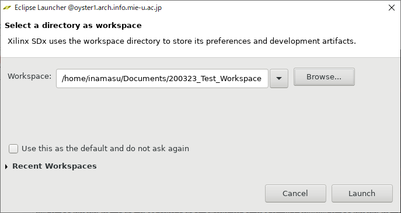
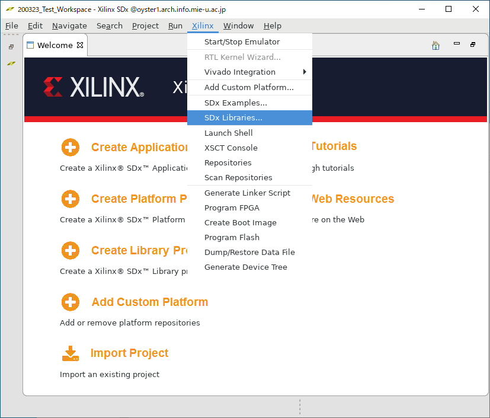

# xfOpenCV-PostProcess
Implement PostProcess with xfOpenCV

作成者 : 稲益秀成

## 概要

Xilinx UltraScale+ MPSoC ZCU104 評価キットで動作するプログラムです。

ポストプロセッシングエフェクト(ポストエフェクト)の"Bloom"をFPGAまたはGPUで実行できます。

FPGA回路はxfOpenCVライブラリ、GPUプログラムはEGLライブラリおよびOpenGL ES 2.0 APIを用いて実装しました。
開発環境はXilinx SDx v2019.1です。

## ビルド済みファイルの実行方法

### 1. ビルド済みファイルをコピー

`share/inamasu/2020/EvaluationProgram/Build/200129_SDCard_filterSize(5|15)_N0_300MHz`のどちらか一方のフォルダ内のファイルを自分の作業環境にコピーする。
<!-- [200117_bloom_sd.zip](https://github.com/Rinadehi/xfOpenCV-PostProcess/releases/download/v2020.1.17/200117_bloom_sd.zip) をダウンロードし、展開する。 -->

### 2. SDカードにファイルを配置

microSDカードをFAT32にフォーマットする。

`200129_SDCard_filterSize(5|15)_N0_300MHz`内のファイルをmicroSDカードにコピーする。

### 3. ZCU104でのsdカードブート

1. ZCU104ボードのDIPスイッチ(SW6)を以下のように設定する。
```
DIP switch SW6:
Mode0 (#1) OFF
Mode1 (#2) ON
Mode2 (#3) OFF
Mode3 (#4) ON
```

2. SDカードをZCU104に挿入する。

3. ZCU104をDisplayPortケーブルでモニターと接続する。

4. USB TypeA端子にUSBキーボード、またはUSBハブ経由でUSBキーボードとUSBマウスを接続する。

5. microUSBケーブルでPCと接続する。

### 4. ブート後の作業


ZCU104でターミナルを開くには、
(1)microUSBでPCと接続し、シリアル通信でターミナルを開く方法 と、
(2)直接ディスプレイとUSBキーボードを接続する方法
の二種類がある。

まずは(1)の方法で作業を行う。
microUSBでPCと接続し、ターミナルを開く。ボーレートは115200に設定する。
(ターミナルには、WindowsPCならTeraTermなどを用いるとよい)


ZCU104の電源スイッチをオンにするとLinuxが起動する。
数分後、入力受付状態になるので、(1)のターミナルで以下のコマンドを実行する。
```
root@xilinx-zcu104-2019_1:~# echo "exec matchbox-terminal" > /home/root/.Xsession
root@xilinx-zcu104-2019_1:~# chmod +x /home/root/.Xsession
root@xilinx-zcu104-2019_1:~# killall Xorg
```
ここで、(2)の直接接続したディスプレイとキーボードの方でターミナルが全画面に表示されるので、以下のコマンドを(2)のターミナルで実行する。
```
# xinit /etc/X11/Xsession
```
すると、(2)のターミナルのフォントや表示が少し変化するので、
(1)のターミナルに戻って、以下のコマンドを実行する。
```
root@xilinx-zcu104-2019_1:~# export DISPLAY=:0.0
root@xilinx-zcu104-2019_1:~# cd /mnt/
root@xilinx-zcu104-2019_1:/mnt# export LD_LIBRARY_PATH=/mnt/lib/
```
これでプログラムが実行できるようになる。


### 5. プログラムの実行方法

```
Usage:	./EGL_xfOpenCV.elf [-f -n number] [-g] [-v] [-m number(1~4)] [-p png-file-name] [-i number(0~10)]

Options:
	 -f : Enable FPGA acceleration / -g : Enable GPU acceleration 
	 -n : Exection time at FPGA mode 	(default : 100)
	 -v : Enable verbose 	(default : false)
	 -m : Change mode at GPU	(default : 1234)
	 -p : Set png file 	(default : Torus.png)
	 -i : Set eglSwapInterval() 0:No Limit, 1:60fps 2:30fps 3:20fps ... 	(default : 0)
```

となっている。

(必ずカレントディレクトリを/mnt/に変更すること。もし./mnt/EGL_xfOpenCV.elfのように実行した場合、GPU用のシェーダーコードを読み込めずにエラーになる)

`-p Torus.png`のように`-p`オプションで読み込む画像ファイルを変更できる。

#### FPGAで実行する場合
```
# ./EGL_xfOpenCV.elf -f
```
とコマンドを実行する。

もし途中でLinux カーネルがフリーズしたりするようなら、`-n 10`といったように`n`オプションで実行回数を変更するとよい。

Bloomの各フェーズおよび全体の実行時間が測定される。

#### GPUで実行する場合
```
# ./EGL_xfOpenCV.elf -g
```
とコマンドを実行する。

OpenGL側のバージョンや、OpenGL実行中に発生したエラーを表示する際は`-v`オプションを指定する。

Bloomの各フェーズごとの実行時間を測定する場合は、`-m`オプションを使用する。
* `-m 1` : 画像の読み込み後、そのまま描画
* `-m 12` : 画像読み込み、高輝度取り出し処理後描画
* `-m 123` :  画像読み込み、高輝度取り出し、ぼかしフィルタ処理後描画
* `-m 1234` : Bloom処理全体の実行 (デフォルト)

フレームレートに制限を書ける場合は`-i`オプションを使用する。
* `-i 0` : フレームレート制限無し(デフォルト)
* `-i 1` : 60fps制限
* `-i 2` : 30fps制限
* `-i 3` : 20fps制限

## 実験パラメータの変更方法

### 入力画像サイズの変更
microSDカード内に画像を配置し、以下のようにプログラムを実行する。
```
# ./EGL_xfOpenCV.elf -p 画像ファイル名.png
```

### フィルタサイズの変更
フィルタサイズ5の場合は`200129_SDCard_filterSize5_N0_300MHz`のファイルを使用し、
15の場合は`200129_SDCard_filterSize15_N0_300MHz`のファイルを使用する。

他のフィルタサイズを設定する場合は再ビルドが必要。

`xf_config_params.h`にて、
```xf_config_params.h
#define  FILTER_HEIGHT  15
#define  FILTER_WIDTH  	15
```
`main.cpp`にて、
```main.cpp
#define SAMPLE_COUNT 15
```
と変更し、再ビルド。


## 開発環境

### ビルド環境
Oyster1
* CentOS 7.7.1908 Core
* Xilinx SDx v2019.1 (64-bit)
* xfOpenCV 2019.1

### 実行環境

* Xilinx Zynq UltraScale+ MPSoC ZCU104 評価キット 

## 各ファイルの説明

`workspace/EGL_xfOpenCV/src`内のファイルの内容は、以下の通りである。

|ファイル名|内容|
|:-------:|----|
|data| ビルドした際に`Release/sd_card/`にコピーされるファイル。テスト用の画像やopenCVのライブラリファイル、GPU用のシェーダーコードを配置してある。|
|egl.cpp / .h| GPUプログラムにおけるEGLライブラリ関連のコード
|main.cpp | メイン関数|
|shader.cpp / .h|GPUプログラムにおけるシェーダーコードを実行するためのコード|
|texture.cpp / h|画像ファイルを読み込むためのコード|
|xf_arithm_*|xfOpenCVにおけるadd関数を使うためのファイル (xfOpenCVのサンプルまま) |
|xf_config_params.h | xfOpenCVの各設定を行うためのパラメータ|
|xf_custom_convolution_*|xfOpenCVにおけるfilter2D関数を使うためのファイル (xfOpenCVのサンプルまま) |
|xf_headers.h|openCVなどのインクルードがされるファイル(ほぼxfOpenCVのサンプルまま) |
|xf_lut_*|xfOpenCVにおけるLUT関数を使うためのファイル (xfOpenCVのサンプルまま) |

## sourcezipからのビルド方法

0. 作業ディレクトリを作成する。以下、workspaceと呼ぶ。

1. `share/inamasu/2020/EvaluationProgram/Source`のデータをworkspaceにコピーする。

2. `zcu104-rv-ss-2018-3.zip`をworkspaceに展開する。

3. ライセンスが登録されたPCで、Vivado SDxを起動する。Workspaceに、0.で作成した作業ディレクトリを指定する。「Launch」をクリックして起動する。


4. Import Project を選択する。


5. Import SDx Projectsを選択し、Archive Fileに`Source/EGL_xfOpenCV.sdx.zip`を指定する。Finishをクリックする。


6. 一度SDxを終了し、エディタで`EGL_xfOpenCV/project.sdx`を編集する。
    * `location="/eda1/home/inamasu/200116_xfOpenCV-PostProcess/workspace/EGL_xfOpenCV`となっている部分を自分のプロジェクトのディレクトリに変更する。
    * `sysrootLocation="/eda1/home/inamasu/191219_xfOpenCV/zcu104-rv-ss-2018-3/zcu104_rv_ss/sw/a53_linux/a53_linux/sysroot/aarch64-xilinx-linux"`を自分のディレクトリに変更する。

6. Active build configurationをReleaseに変更し、ビルドする。(初回ビルドにはIntel Xeon E5-2620 v4にて1時間程度かかった。)


## (参考) gitリポジトリからのビルド方法 【利用不可】
(2020/03/20)
卒業までに研究室内のGitにプッシュできなかったので、このビルド方法は利用できません。

### 0. 準備

[reVISION 入門ガイド 3. ソフトウェア ツールおよびシステム要件](https://github.com/Xilinx/reVISION-Getting-Started-Guide/blob/master/docs-jp/Docs/software-tools-system-requirements.md) 内の[zcu104-rv-ss-2018-3.zip](https://japan.xilinx.com/member/forms/download/design-license-xef.html?filename=zcu104-rv-ss-2018-3.zip)
をダウンロードし、展開する。

### 1. xfOpenCVのインストール

Xilinx SDx v2019.1 (64-bit)を起動する。

適当なworkspaceを指定し、ウインドウが表示されたら、メニューのXilinx -> SDx Libraries... を選択

ここで、xfOpenCVのインストールを行う。

### 2. 新しいプロジェクトの作成

メニューから File -> New -> SDx Application Project を選択し、適当なプロジェクト名をつける。

Platformは**ZCU104**を指定する。

System Configurationでは、
 * System configuration : **A53 Linux**
 * Runtime : **C/C++**
 * Domain : **a53_linux**
 * Sysroot path : `/<ダウンロードしたzcu104-rv-ss-2018-3を展開したディレクトリ>/zcu104_rv_ss/sw/a53_linux/a53_linux/sysroot/aarch64-xilinx-linux`

と設定する。

Templatesでは、**customconv - File I/O**を選択し、Finishをクリック

以上の手順でサンプルプロジェクトを作成できる。

### 3. 本リポジトリからソースファイルをコピー

一度Xilinx SDxを終了する。

作成したプロジェクトの`src`ディレクトリ内のファイルを削除し、

本リポジトリを`git clone`し、`workspace/EGL_xfOpenCV/src`内のファイルを、作成したプロジェクトの`src`にインポートする。

本リポジトリの`workspace/EGL_xfOpenCV/project.sdx`を参考に、作成したプロジェクトの`project.sdx`を編集する。

* `location="/eda1/home/inamasu/200116_xfOpenCV-PostProcess/workspace/EGL_xfOpenCV`となっている部分を自分のプロジェクトのディレクトリに変更する。

### 4. ビルド

再度 Xilinx SDxを起動し、ビルド設定をReleaseに変更し、ビルドを実行する。

ビルドに成功すれば完了。(初回ビルドにはIntel Xeon E5-2620 v4にて1時間程度かかった。)


## (参考) xf_config_params.hのパラメータについて

```
/*  set the optimization type  */
#define NO  1  	// Normal Operation
#define RO  0  	// Resource Optimized
```

にて、N0を1にするとxfOpenCVの各処理を1ピクセルずつ処理を行う。
R0にすると8ピクセルずつ処理を行う。

しかし、R0に設定するとFilter2Dの結果が真っ黒になってしまう問題が発生したため、N0を指定した。原因はまだわかっていません。(2020/03/20時点)

```
#define GRAY 0
#define RGBA 1
```

グレースケールで処理するか、カラーで処理するかを指定する。今回はカラーで実行したいため`RGBA`を指定

```
#define ARRAY	1
#define SCALAR	0
//macros for accel
#define FUNCT_NAME add // change from mutiply to add by inamasu
//#define EXTRA_ARG  0.05 // comment out by inamasu
#define EXTRA_PARM XF_CONVERT_POLICY_SATURATE

//OpenCV reference macros
#define CV_FUNCT_NAME add // change from mutiply to add
#define CV_EXTRA_ARG  0.05
```
ここで、画像(mat)+画像のadd関数が実行されるよう設定している。
